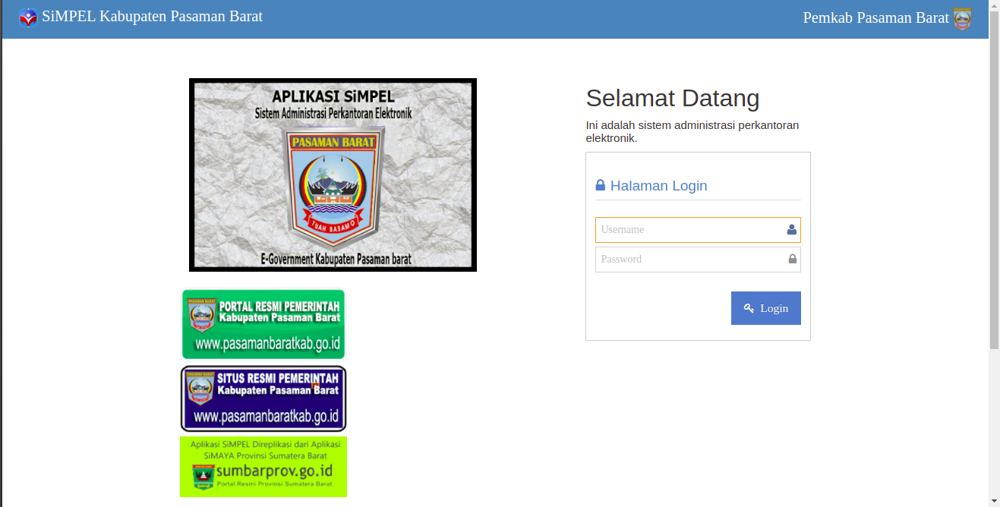
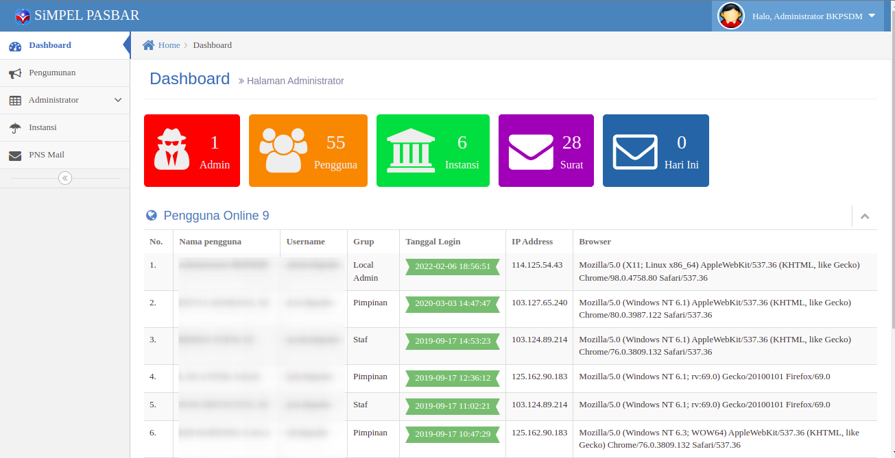
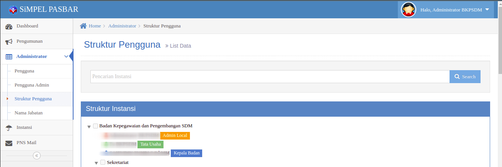
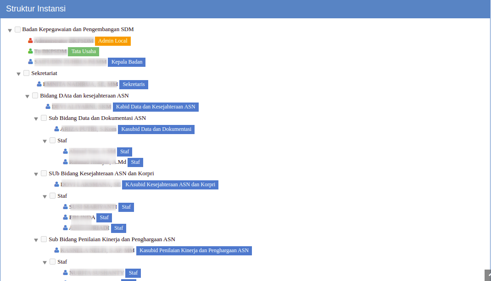
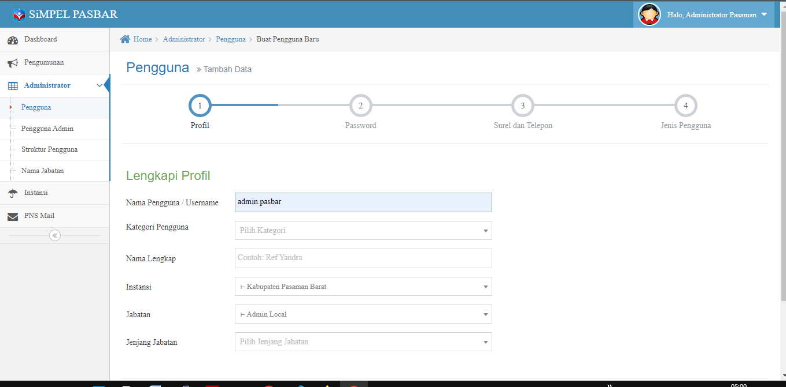

# Login Simpel Pasaman Barat

<a href="https://simpel.pasamanbaratkab.go.id" target="_blank">Login Administrator Simpel simpel.pasamanbaratkab.go.id</a>

### Simpel.pasamanbaratkab.go.id   
Dasboard Administator Web akan muncul seperti ini :
<a href="https://simpel.pasamanbaratkab.go.id" target="_blank">Login Administrator Simpel</a>

   {loading=lazy width=80%;}
   {loading=lazy width=80%;}

#### Struktur Organisasi
  - Pengaturan **Struktur Organisasi** simpel terletak pada menu kiri  **Administrator > Struktur Pengguna**

  {loading=lazy width=80%;}

!!! warning "Struktur harus selalu diperbaharui (Mempengaruhi Laporan Harian Pegawai)"
    **Administrator Instansi** harus menyesuaikan **struktur organisasi** sesuai dengan struktur instansi yang sedang berlangsung.
    Kecocokan sturktur mempengaruhi persetujuan laporan harian **atasan** terhadap **staf**.

Struktur  
  {loading=lazy width=80%;}

## Daftar Pegawai  
!!! warning "Struktur harus selalu diperbaharui (Mempengaruhi Laporan Harian Pegawai)"
    **Mutasi Pegawai** dilakukan kepada {==Super Adminidtrator==} (Admin Pasaman Barat)
### Tambah Pegawai 
!!! info "Menu" 
    Administrator :material-arrow-right-thick: Pengguna :material-arrow-right-thick: Tambah Pengguna
{loading=lazy width=80%;}

#### Form Profile
Keterangan untuk pengisian formulir profile pegawai dijelaskan sebagai berikut:
##### 1. Nama Pengguna/Username

- [x] Menggunakan huruf kecil `wajib`
- [ ] Spasi huruf `tidak diboleh`
- [x] Harus unik `tidak boleh sama dengan pegawai yang sudah terdaftar sebelumnya`
- [x] Memakai kombinasi angka `disarankan`
- [x] Bagi PNS/CPNS menggunakan nomor NIP `disarankan` 

##### 2. Kategori Pengguna

- [x] PNS `Termasuk CPNS`
- [x] Jabatan Politik `Bupati, Wakil dan Anggota DPRD`
- [x] Polri `Kepolisian`
- [x] Honorer `THL/Kontrak`

##### 3. Nama Lengkap
`Ditulis beserta gelar pegawai`
##### 4. Instansi
`Yang dimaksud dengan instansi disini trrmasuk jabatan yang duduki/jabat saat ini`
##### 5. Jabatan
`Jabatan pegawai`
##### 6. Jenjang Jabatan
`Pilih Jenjang Jabatan, contoh (Eselon I,II,III jika tidak ada pilih sebagai staf)`
##### 7. Golongan
`Dibutuhkan Jika Kategori Pengguna sebagai PNS`
##### 8. NIP
`Dibutuhkan Jika Kategori Pengguna sebagai PNS`
##### 9. NRP
`Dibutuhkan Jika Kategori Pengguna sebagai Polri`

### Tatacara Mutasi Pegawai
1. Laporkan Pegawai yang aakan di mutasikan ke OPD yang bersangkutan pada Admin Pasaman Barat
2. Pegawai yang telah di proses mutasi oleh Admin Pasaman Barat akan berada pada struktur teratas OPD/instansi
3. Admin OPD/Instansi melakukan verifikasi pemutasi pegawai dengan cara mengedit struktur organisasi untuk meletakkan pegawai tersebut sesuai jabatan pegawai. 

