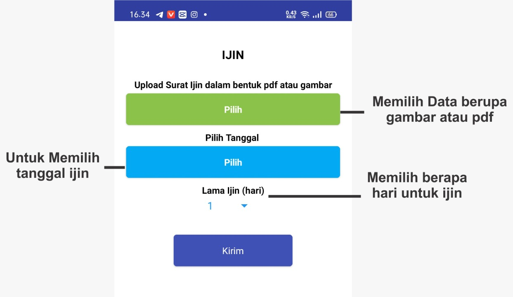
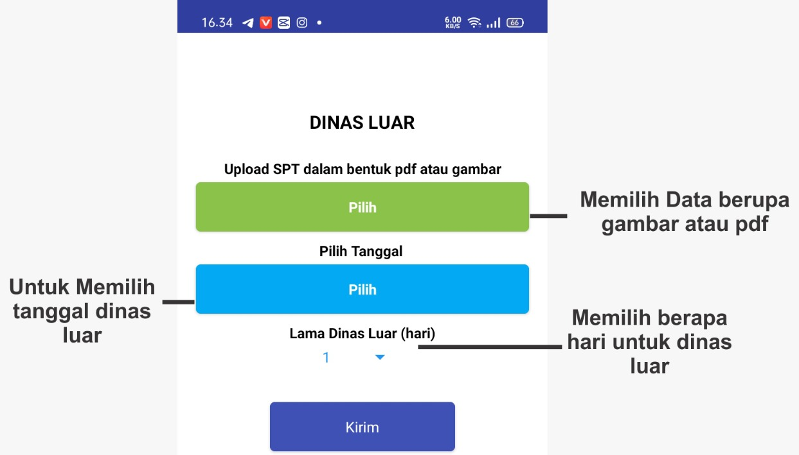
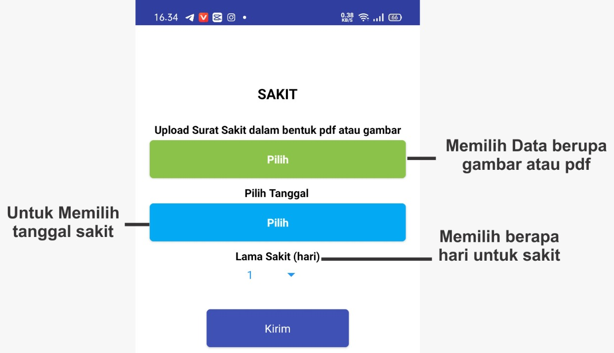

# Absensi

## Dasboard
!!! Warning "Wajib dipatuhi, saat melakukan absensi kehadiran"
    1. Pengguna harus terhubung pada Wifi Yang didaftarkan oleh admin instansi
    2. GPS Harus dinyalakan      

### Wifi
    Informasi Wifi Yang sedang terkoneksi pada perangkat Anda.

### Profile User
    Informasi Nama  dan Jabatan pengguna sebagai Pegawai sesuai Struktur Organisasi

### Tanggal dan Waktu
    Tanggal dan waktu saat anda melakukan absensi, selelu menyesuaikan berdasarkan waktu server.

### Tombol
#### Absen Masuk dan Pulang
!!! Warning "Tombol Absen Masuk"
    Pastikan fitur **WIFI** dan **GPS** pada perangkat Anda dalam keadaan **Aktif** sebelum menekan tombol absen.

  - WIFI <code>Wajib Aktif</code> (Sesuai pengaturan Administrator Instasi)
  - GPS <code>Wajib Aktif</code>

!!! tip "Jika Wifi belum tampil pada aplikasi"
      Keluar dari aplikasi lalu buka kembali aplikasi Absen Online, sampai Wifi yang sudah ditentukan oleh Administrator Instansi tampil pada status Wifi.

#### Izin

#### Dinas Luar

#### Sakit

#### Laporan
Laporan harian

Pada fitur ini Pegawai dapat membuat laporan harian pada halaman ini.
Untuk panduan lebih lanjut silahkan pelajari [Petujnujuk Mengisi Laporan Harian](/Pengguna/laporan-harian)
### Logout
Mengakhiri sesi Anda pada Absensi Online, terletak pada pojok kanan atas aplikasi. 