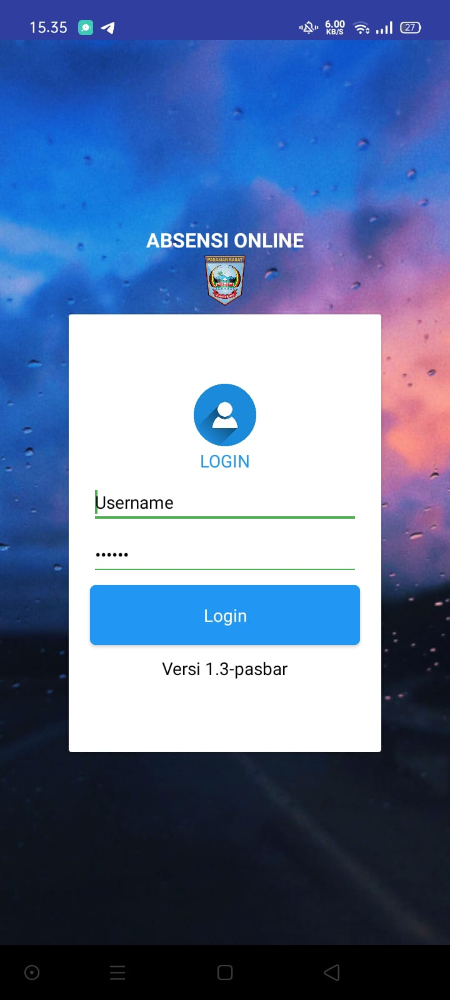

# Login
Tampilan login pada perangkat android Android

    • Username : Isi dengan Username administator. Contoh : admin.namaopd
    • Password : Isi dengan Password administrator. Contoh : ********
{loading=lazy width=40%;}

## Daftar sebagai pengguna
Pengguna secara administrasi didaftarkan oleh **Administrator Instansi** masing-masing, informasi lebih lanjut  [Pendaftaran Pengguna / Pegawai](../Pengguna/daftar) 

