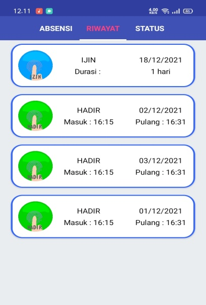

# Riwayat

## Riwayat Absen
Menampilkan riwayat absen pegawai, Kehadiran pegawai akan langsung ditampilkan dihalaman ini. Sedangkan untuk staus **Izin**, **Dinas Luar** dan **Sakit** harus melewati persetujuan **Atasan**, maka riwayat absen akan diteruskan pada bilah [status](/Pengguna/status).  

Status yang ditampilkan :

  - Hadir
  - Ijin
  - Dinas Luar
  - Sakit
 
!!! tip
    Status **Izin**, **Dinas Luar** dan **Sakit** harus melalui persetujuan **Atasan**. Jika Atasan menyetujui maka akan ditampilkan pada [riwayat](/Pengguna/riwayat/#tampilan-riwayat-absensi) ini. 

## Tampilan Riwayat Absensi
