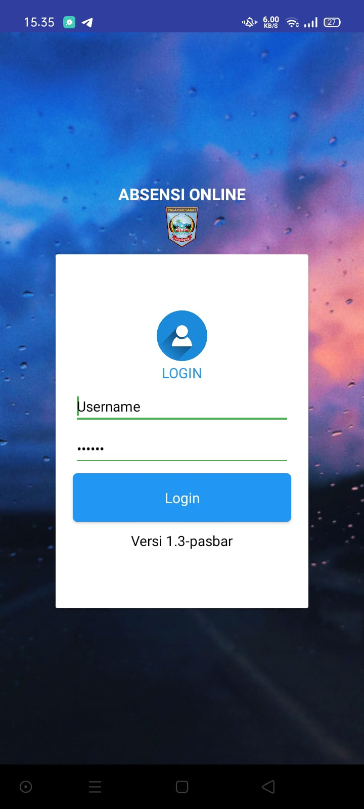

# Menu
## MENU DAN CARA PENGGUNAAN
### Struktur Menu
Adapun Struktur menu pada aplikasi Absensi Online sebagai berikut:

#### 1. Menu Login
   * [Login Pengguna](../Pengguna/login)

##### a. Sebagai Administrator
 * [Menyimpan Wifi](../Administrator/#wifi-yang-terhubung)
 
##### b. Sebagai Pimpinan
 * [Absensi](../Pengguna/) 
 * [Riwayat](../Pengguna/riwayat) 
 * [Status](../Pengguna/status) 
##### c. Sebagai Staff
 * [Absensi](../Pengguna/) 
 * [Riwayat](../Pengguna/riwayat) 
 * [Status](../Pengguna/status) 

### User/Pengguna
Semua pegawai yang telah terdaftar/didaftarkan oleh admin instasi pada aplikasi [simpel.pasamanbaratkab.gi.id](https://Simpel.pasamanbaratkab.gi.id)

### Cara Pengguna aplikasi
Untuk menggukan aplikasi, terlebih dahulu [unduh](#) dan instal aplikasinya. Setelah aplikasi diinstal, silahkan dijalankan dan akan muncul halaman [login](/Pengguna/login) :

{loading=lazy width=40%;}

